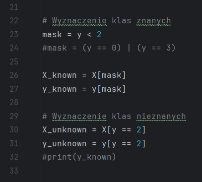
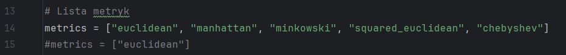
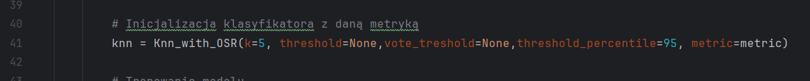
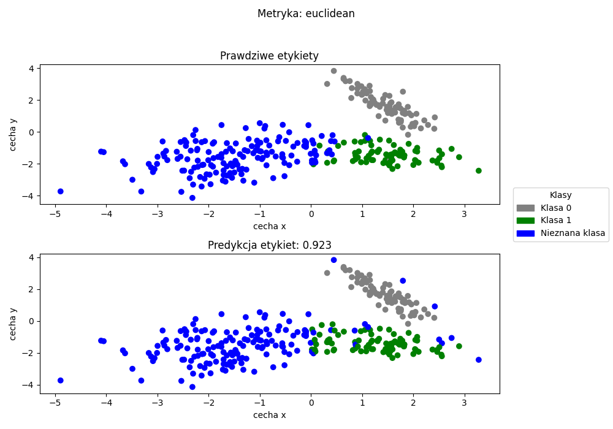

# Implementacja algorytmu k-Najbliższych Sąsiadów dla zadania Open Set Recognition

Projekt został stworzony w oparciu o algorytm k-NN z zastosowaniem mechanizmu Open Set Recognition (OSR) do klasyfikacji
danych na podstawie znanych klas, a także rozpoznawania obiektów należących do klas nieznanych w przypadku przekroczenia obliczonego progu.
Na potrzeby testowania klasyfikatora można dostosowywać wartości k, prógu klasyfikacji, percentylu oraz prógu głosowania.

Klasyfikacja została przeprowadzona na trzech różnych zbiorach danych:
- Zbiorze syntetycznym
- Dry Beans
- Letter Recognition

Dodatkowo program korzysta z pięciu metryk do klasyfikacji obiektów:
- Metryka Euklidesowa
- Metryka Manhattan
- Metryka Minkowskiego
- Metryka Kwadratowo-Euklidesowa
- Metryka Chebysheva

## Funkcje programu:
- Tworzenie syntetycznego zbioru danych
- Odczyt danych ze zbiorów
- Podział danych na klasy znane i nieznane
- Implementacja klasyfikatora
- Tworzenie wykresów porównania etykiet rzeczywistych i przewidzianych dla zbioru syntetycznego
- Wyświetlanie wyników: Średnia z 10 powtórzeń, metryka balenced accuracy score

## Instrykcja dla użytkownika:
Należy odkomentować odpowiedni zbiór i dodonać podziału na klasy znane i nieznane.

Należy określić badane metryki:

Należy podać odpowiednie parametry konstruktora:

## Przykładowe wyniki:

<h3>Wykres dla metryki Euklidesowej</h3>

  

<h3>Macierz pomyłek dla metryki Euklidesowej</h3>

<table>
  <thead>
    <tr>
      <th></th>
      <th>Klasa 0</th>
      <th>Klasa 1</th>
      <th>Klasa obca 2</th>
    </tr>
  </thead>
  <tbody>
    <tr>
      <th>Klasa 0</th>
      <td align="center">92</td>
      <td align="center">7</td>
      <td align="center">1</td>
    </tr>
    <tr>
      <th>Klasa 1</th>
      <td align="center">2</td>
      <td align="center">90</td>
      <td align="center">8</td>
    </tr>
    <tr>
      <th>Klasa obca 2</th>
      <td align="center">1</td>
      <td align="center">23</td>
      <td align="center">176</td>
    </tr>
    <tr>
      <td colspan="4" align="center"><strong>Procent poprawnych predykcji: 0.900</strong></td>
    </tr>
  </tbody>
</table>

<h3>Wyniki programu</h3>

<table>
  <thead>
    <tr>
      <th>Metryka</th>
      <th>Treshold</th>
      <th>Wynik</th>
    </tr>
  </thead>
  <tbody>
    <tr>
      <td>Euclidean</td>
      <td>0.204</td>
      <td>0.904 (0.01)</td>
    </tr>
    <tr>
      <td>Manhattan</td>
      <td>0.256</td>
      <td>0.903 (0.01)</td>
    </tr>
    <tr>
      <td>Minkowski</td>
      <td>0.19</td>
      <td>0.905 (0.009)</td>
    </tr>
    <tr>
      <td>Squared_euclidean</td>
      <td>0.041</td>
      <td>0.904 (0.01)</td>
    </tr>
    <tr>
      <td>Chebyshev</td>
      <td>0.181</td>
      <td>0.907 (0.01)</td>
    </tr>
  </tbody>
</table>

## Środowisko programistyczne
- Python 3.12 lub nowszy

## Wymagane biblioteki
- numpy
- scikit-learn
- pandas
- matplotlib

## Struktura projektu
- `datasets/` - Pliki CSV ze zbiorami danych
    - `Dry_Bean.csv`
    - `letter-recognition.csv`
- `results/` - Wygenerowane wykresy porównawcze etykiet rzeczywistych i przewidzianych dla każdej z metryk
    - `chebyshev_True_Predict.png`
    - `euclidean_True_Predict.png`
    - `manhattan_True_Predict.png`
    - `minkowski_True_Predict.png`
    - `squared_euclidean_True_Predict.png`
    - `syntetic_dataset` - wykres dla danych syntetycznych
- `Classification.py` - Implementacja klasyfikatora k-NN z OSR
- `Operations.py` - Generowanie danych treningowych i tworzenie wykresów
- `Read_data.py` - Odczyt danych ze zbiorów
- `Split_class.py` - Podział zbioru na klasy znane i nieznane
- `main.py` - Główny plik uruchamiający program
- `requirements.txt` - Plik z listą zależności potrzebnych do uruchomienia projektu
- `.gitignore` - Plik określający, które pliki i foldery mają być pomijane przez Gita

## Autorzy projektu
- Szymon Bęczkowski
- Piotr Kontny
- Adam Ślusarski

