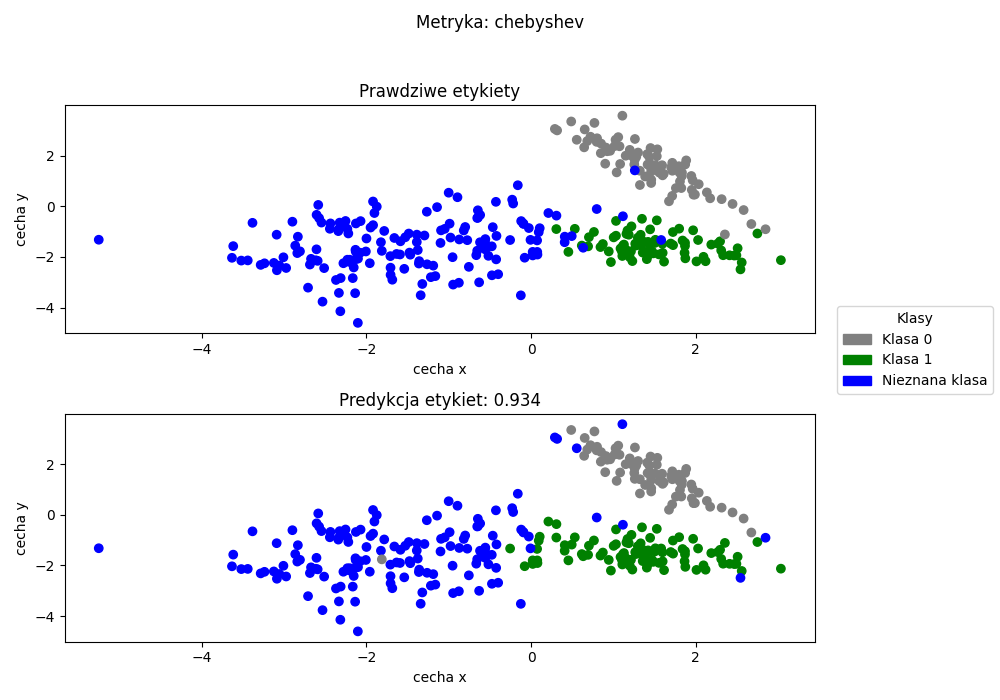

# Implementacja algorytmu k-Najbliższych Sąsiadów dla zadania Open Set Recognition

Projekt został stworzony w oparciu o algorytm k-NN z zastosowaniem mechanizmu Open Set Recognition (OSR) do klasyfikacji
danych na podstawie znanych klas, a także rozpoznawania obiektów należących do klas nieznanych w przypadku przekroczenia obliczonego progu.
Na potrzeby testowania klasyfikatora można dostosowywać wartości k, prógu klasyfikacji, percentylu oraz prógu głosowania.

Klasyfikacja została przeprowadzona na czterech różnych zbiorach danych:
- Dry Beans
- Steel Plates Defection
- Sensors
- Zbiórze syntetycznym

Dodatkowo program korzysta z pięciu metryk do klasyfikacji obiektów:
- Metryka Euklidesowa
- Metryka Manhattan
- Metryka Minkowskiego
- Metryka Kwadratowo-Euklidesowa
- Metryka Chebysheva

## Funkcje programu
- Tworzenie syntetycznego zbioru danych
- Odczyt danych ze zbiorów
- Obliczanie progu klasyfikacji za pomocą percentylu dla każdej metryki osobno
- Tworzenie wykresów porównania etykiet rzeczywistych i przewidzianych
- Wyświetlanie wyników: procent poprawnych predykcji oraz macierze pomyłek jako obiekty `DataFrame` (dla każdej metryki)

## Przykładowe wyniki: wykresy końcowe i macierz pomyłek

<h3>Wykres dla metryki Euklidesowej</h3>

  

<h3>Wykres dla metryki Chebysheva</h3>

  

Macierz pomyłek:

## Środowisko programistyczne
- Python 3.12 lub nowszy

## Wymagane biblioteki
- numpy
- scikit-learn
- pandas
- matplotlib

## Struktura projektu
- `datasets/` - Pliki CSV ze zbiorami danych
    - `Dry_Bean.csv`
    - `Sensorless_drive_diagnosis.csv`
    - `Steel.csv`
- `results/` - Wygenerowane wykresy porównawcze etykiet rzeczywistych i przewidzianych dla każdej z metryk
    - `chebyshev_True_Predict.png`
    - `euclidean_True_Predict.png`
    - `manhattan_True_Predict.png`
    - `minkowski_True_Predict.png`
    - `squared_euclidean_True_Predict.png`
    - `syntetic_dataset` - wykres dla danych syntetycznych
- `Classification.py` - Implementacja klasyfikatora k-NN z OSR
- `Operations.py` - Generowanie danych treningowych i tworzenie wykresów
- `Read_data.py` - Odczyt danych ze zbiorów
- `Syntetic_data.py` - Obsługa zbioru syntetycznego (podział na treningowy i testowy)
- `main.py` - Główny plik uruchamiający program
- `requirements.txt` - Plik z listą zależności potrzebnych do uruchomienia projektu
- `.gitignore` - Plik określający, które pliki i foldery mają być pomijane przez Gita

## Autorzy projektu
- Szymon Bęczkowski
- Piotr Kontny
- Adam Ślusarski

